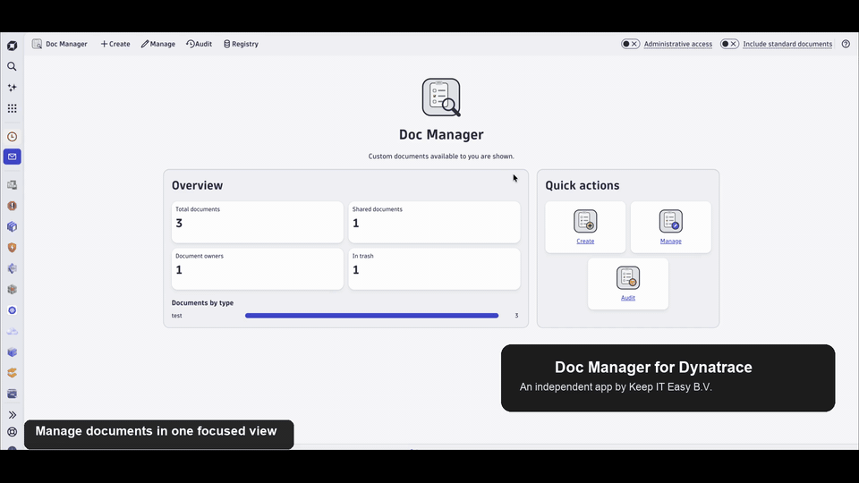

# Doc Manager for Dynatrace

Doc Manager for Dynatrace is an independent app for managing standard and custom documents in Dynatrace.

## Video demo

## App walkthrough

### Create documents

Create a document by entering its content directly or uploading a file.

### Manage documents

Search and filter documents available in the environment. Administrative access can be enabled for users with the required permissions.

### Review document activity

Use the audit view to review document actions performed through Dynatrace apps and APIs.

### Review deleted-document records

The registry provides read-only metadata records captured when documents are deleted.

## Release overview

| Release | Highlights |
| --- | --- |
| **v1.2.5** — Latest | Introduces consistent **Doc Manager** naming throughout the app and its supporting policies and workflow template. |
| **v1.2.4** | Adds the Deleted Document Registry, document lookup by name or ID, and improved document visibility and audit activity. |
| **v1.1.0** | Adds a workflow action for retrieving document content so documents can be used in Dynatrace workflows. |
| **v1.0.0** | Introduces the core experience for creating, viewing, updating, sharing, recovering, and auditing documents. |

## About and contact

Doc Manager for Dynatrace is an independent product developed by [Keep IT Easy B.V.](https://www.keepiteasy.nl/) and is not an official Dynatrace product.

For product details, licensing, or other enquiries:

- Website: [keepiteasy.nl](https://www.keepiteasy.nl/)
- Contact: [keepiteasy.nl/contact](https://www.keepiteasy.nl/contact)
- Email: [info@keepiteasy.nl](mailto:info@keepiteasy.nl)
- LinkedIn: [Keep IT Easy](https://www.linkedin.com/company/keepiteasy)

## License

Copyright © 2026 Keep IT Easy B.V. All rights reserved.

This repository is proprietary and is made public for informational purposes only. See [LICENSE.md](LICENSE.md) for the applicable terms.
