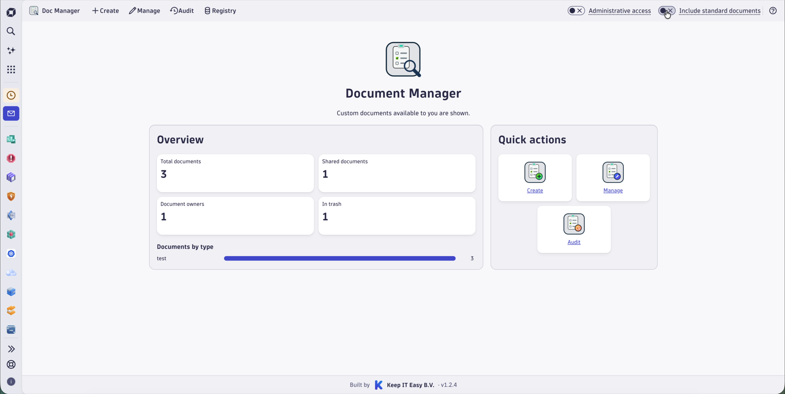
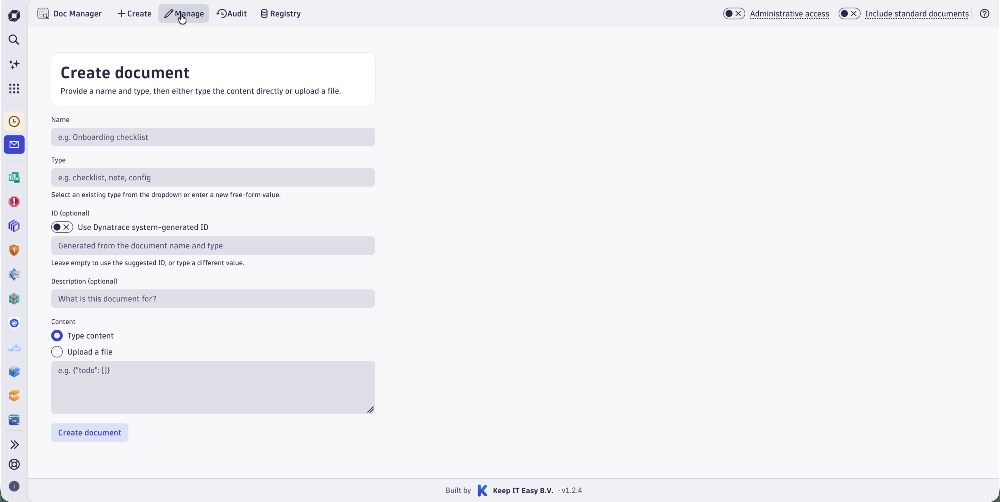
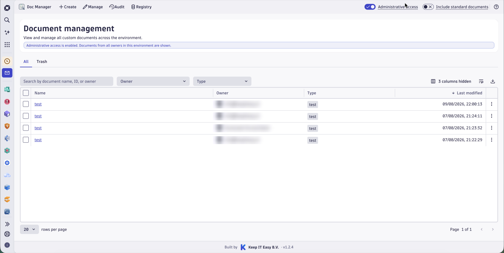
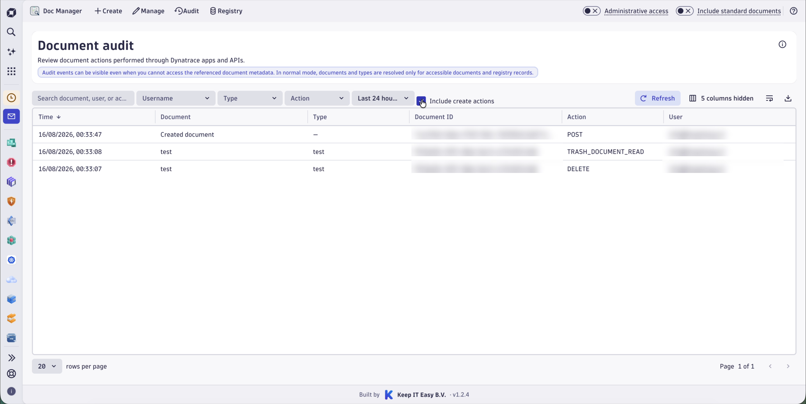
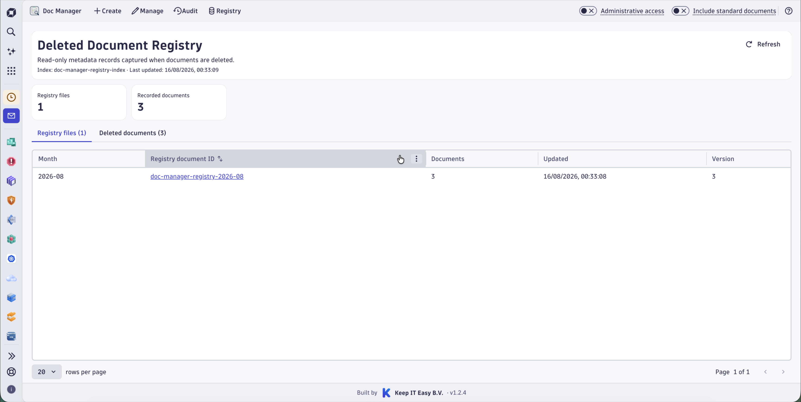

# Dynatrace Document Manager

Dynatrace Document Manager is an app for managing standard and custom documents in Dynatrace.

## Video demo

Watch the [28-second Document Manager teaser](assets/video/document-manager-teaser.mp4) for a quick tour of the main workflow.

## App walkthrough

### Create documents

Create a document by entering its content directly or uploading a file.

### Manage documents

Search and filter documents available in the environment. Administrative access can be enabled for users with the required permissions.

### Review document activity

Use the audit view to review document actions performed through Dynatrace apps and APIs.

### Review deleted-document records

The registry provides read-only metadata records captured when documents are deleted.

## Project status

This repository is being prepared for its first public source release. The application source and installation package are not yet available in the repository.

## Documentation

Public usage, configuration, and development instructions will accompany the first source release so that every documented command can be tested against the published code.

## License

Copyright © 2026 Keep IT Easy B.V. All rights reserved.

This repository is proprietary and is made public for informational purposes only. See [LICENSE.md](LICENSE.md) for the applicable terms.
